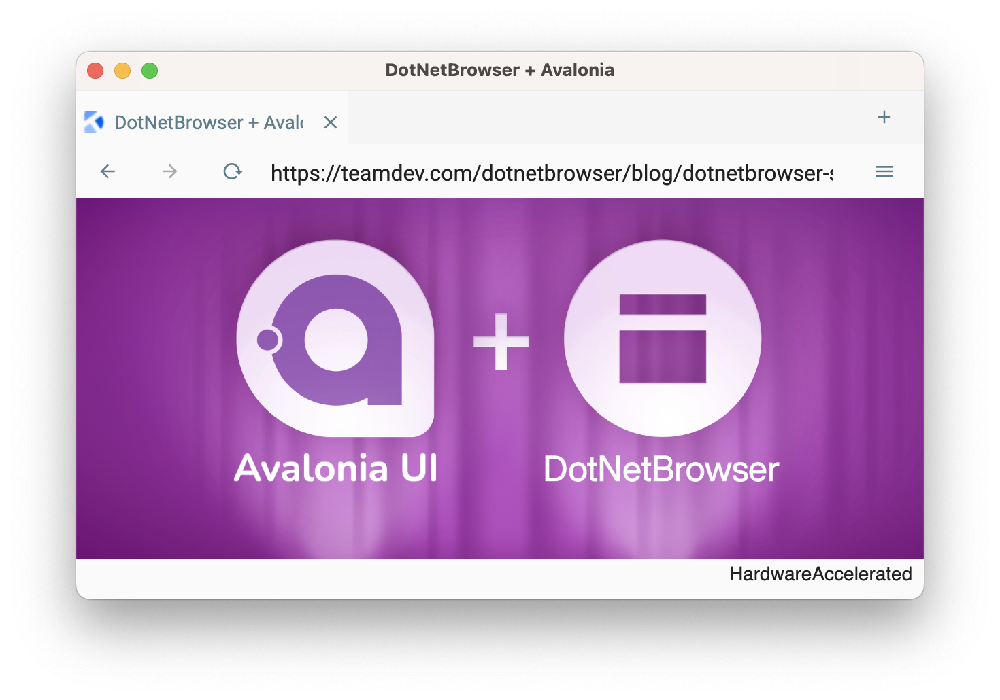

<h1 align="center">Avalonia WebView</h1>

<p align="center"><strong>A demo that shows how to use <a href="https://teamdev.com/dotnetbrowser" target="_blank">DotNetBrowser web view</a> in <a href="https://avaloniaui.net/" target="_blank">Avalonia UI</a>.</strong></p>

<p align="center"><strong>Works on Windows, macOS, and Linux.</strong></p>

<p align="center">
  
</p>

## What is DotNetBrowser

DotNetBrowser is a cross-platform Chromium-based web view control. Notable features:

 * Embed DotNetBrowser into Avalonia UI, WPF, and WinForms.
 * Use DotNetBrowser for automation in server applications and Windows services.
 * Advanced printing API.
 * Advanced DOM API.
 * Call .NET from JavaScript and vice versa.
 * and [many others](https://teamdev.com/dotnetbrowser/#features).

DotNetBrowser subscription comes with professional and confidential support services. All support requests are processed by DotNetBrowser engineers.

## Prerequisites

* .NET 6.0

## How to run

Get a 30-day free trial license for DotNetBrowser by [this link](https://links.teamdev.com/evaluate-dotnetbrowser-ghrm). The license will arrive in your inbox in an instant.

Then execute this command from the solution directory:

   ```bash
   dotnet run --project DotNetBrowser.AvaloniaUi.Demo
   ```

You can also:

<a href='https://codespaces.new/TeamDev-IP/Avalonia-Browser'></a>

## Credits

* Thanks to [Avalonia UI team](https://github.com/AvaloniaUI/Avalonia) for the great technology and collaboration.
